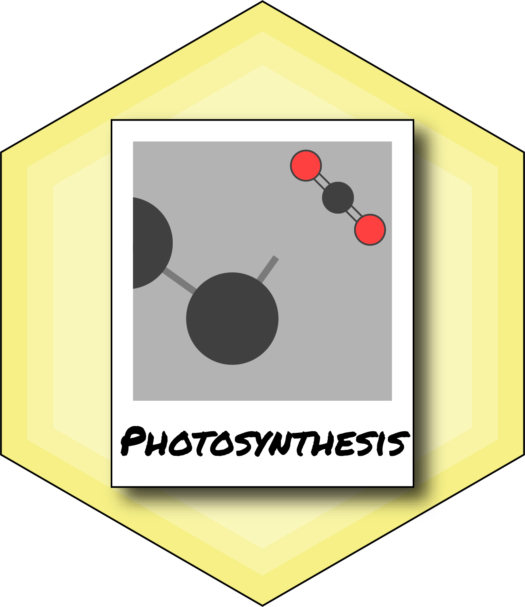

```{r echo=FALSE}
knitr::opts_chunk$set(
  warning = FALSE,
  message = FALSE,
  collapse = TRUE,
  comment = "#>"
)
```

photosynthesis 
=======

[](http://www.repostatus.org/#wip)
[](https://travis-ci.com/cdmuir/photosynthesis)
<!---
[](https://codecov.io/gh/cdmuir/photosynthesis)
[](https://github.com/metacran/cranlogs.app)
[](https://cran.r-project.org/package=photosynthesis)
-->

## Model C3 Photosynthesis

## Description

`photosynthesis` is a lightweight R package to model C3 photosynthesis using the Farquhar-von Caemmerer-Berry model. It uses the R package [units](https://cran.r-project.org/web/packages/units/index.html) to ensure that parameters are properly specified and transformed before calculations. 

## Get `photosynthesis`

or from GitHib

```r
install.packages("devtools")
devtools::install_github("cdmuir/photosynthesis")
```

And load `photosynthesis`

```r
library("photosynthesis")
```

## Vignette

```{r child = 'vignettes/photosynthesis-introduction.Rmd'}
```

## Contributors

* [Chris Muir](https://github.com/cdmuir)

## Comments and contributions

I welcome comments, criticisms, and especially contributions!
GitHub issues are the preferred way to report bugs, ask questions, or request new features.
You can submit issues here:

https://github.com/cdmuir/photosynthesis/issues

## Meta

* Please [report any issues or bugs](https://github.com/cdmuir/photosynthesis/issues).
* License: MIT
<!--- * Get citation information for `photosynthesis` in R doing `citation(package = 'photosynthesis')` -->
* Please note that this project is released with a [Contributor Code of Conduct](CONDUCT.md). By participating in this project you agree to abide by its terms.
