<!-- README.md is generated from README.Rmd. Please edit that file -->

# photosynthesis 

<!-- badges: start -->

[](https://cran.r-project.org/package=photosynthesis)
[](https://cran.r-project.org/package=photosynthesis)
[](https://lifecycle.r-lib.org/articles/stages.html#experimental)
<!-- badges: end -->

## Model C3 Photosynthesis

## Description

**photosynthesis** is an R package with modeling tools for C3
photosynthesis, as well as analytical tools for curve-fitting plant
ecophysiology responses. It uses the R package
[**units**](https://CRAN.R-project.org/package=units) to ensure that
parameters are properly specified and transformed before calculations.

## Get **photosynthesis**

From CRAN

``` r
install.packages("photosynthesis")
```

or from GitHub

``` r
install.packages("remotes")
remotes::install_github("cdmuir/photosynthesis")
```

And load `photosynthesis`

``` r
library("photosynthesis")
```

## Vignettes

The **photosynthesis** package simulates photosynthetic rate given a set
of leaf traits and environmental conditions by solving the Farquhar-von
Caemmerer-Berry C3 biochemical model. There are two main steps to using
**photosynthesis**:

1.  define leaf parameters, environmental parameters, temperature
    response parameters, and physical constants; and
2.  solve for the chloroplastic CO2 concentration that balances CO2
    supply and demand (`photo` and `photosynthesis` for single and
    multiple parameter sets, respectively).

In this vignette, I’ll show you how to:

-   run a minimum worked example using default parameters
-   replace default parameters
-   simulate photosynthetic rate along a gradient of
    CO
    concentrations
    (
    curve)

## Minimum worked example

You can use the default parameter settings and simulate photosynthetic
rate in a single leaf using the `make_*()` functions and `photo()`.

``` r
library(dplyr)
library(magrittr)
library(photosynthesis)

# Leaving the make_* functions empty will automatically default to defaults
# parameters.
bake_par   <- make_bakepar()                       # temperature response parameters
constants  <- make_constants(use_tealeaves = FALSE) # physical constants
leaf_par   <- make_leafpar(use_tealeaves = FALSE)   # leaf parameters
enviro_par <- make_enviropar(use_tealeaves = FALSE) # environmental parameters

photo(leaf_par, enviro_par, bake_par, constants, quiet = TRUE,
      use_tealeaves = FALSE)
#>           C_chl        value convergence                     g_tc
#> 1 24.52925 [Pa] -1.09648e-06           0 1.668765 [umol/m^2/Pa/s]
#>                       A            g_mc25              g_sc                g_uc
#> 1 27.48581 [umol/m^2/s] 4 [umol/m^2/Pa/s] 4 [umol/m^2/Pa/s] 0.1 [umol/m^2/Pa/s]
#>   gamma_star25          J_max25       K_C25        K_O25  k_mc  k_sc  k_uc
#> 1   3.743 [Pa] 200 [umol/m^2/s] 27.238 [Pa] 16.582 [kPa] 1 [1] 1 [1] 1 [1]
#>   leafsize     phi_J          R_d25     T_leaf   theta_J         V_cmax25
#> 1  0.1 [m] 0.331 [1] 2 [umol/m^2/s] 298.15 [K] 0.825 [1] 150 [umol/m^2/s]
#>            V_tpu25 g_mc gamma_star J_max    K_C    K_O R_d V_cmax V_tpu   C_air
#> 1 200 [umol/m^2/s]    4      3.743   200 27.238 16.582   2    150   200 41 [Pa]
#>                O              P              PPFD      RH    wind
#> 1 21.27565 [kPa] 101.3246 [kPa] 1500 [umol/m^2/s] 0.5 [1] 2 [m/s]
```

## Replace default parameters

You can look at default parameters settings in the manual (run
`?make_parameters`). These defaults are reasonable, but of course you
will probably want to use different choices and allow some parameters to
vary. Here, I’ll demonstrate how to replace a default. In the next
section, I’ll show you how to set up a gradient of parameter values over
which to solve for leaf temperature.

``` r
# Use the `replace` argument to replace defaults. This must be a named list, and
# each named element must have the proper units specified. See `?make_parameters`
# for all parameter names and proper units.

# Temperature response parameters can be updated (but we won't do that here)
bake_par <- make_bakepar()

# Physical constants probably do not need to be replaced in most cases,
# that's why we call them 'constants'!
constants  <- make_constants(use_tealeaves = FALSE)

# First, we'll change photosynthetic photon flux density to 1000 umol / (m^2 s)
enviro_par <- make_enviropar(
  replace = list(
    PPFD = set_units(1000, "umol/m^2/s")
    ), use_tealeaves = FALSE
  )

# Next, we'll change stomatal conductance to 3 umol / (m^2 s Pa)
leaf_par <- make_leafpar(
  replace = list(
    g_sc = set_units(3, "umol/m^2/s/Pa")
    ), use_tealeaves = FALSE
  )

photo <- photo(leaf_par, enviro_par, bake_par, constants, quiet = TRUE,
               use_tealeaves = FALSE)

photo %>%
  select(PPFD, C_chl, A) %>%
  knitr::kable()
```

|                PPFD |          C_chl |                       A |
|--------------------:|---------------:|------------------------:|
| 1000 \[umol/m^2/s\] | 24.0449 \[Pa\] | 25.21885 \[umol/m^2/s\] |

## Environmental gradients

In the previous two examples, I used the `photo` function to solve for a
single parameter set. In most cases, you’ll want to solve for many
parameter sets. The function `photosynthesis` generalizes `photo` and
makes it easy to solve for multiple parameter sets using the same
argument structure. All you need to do is specify multiple values for
one or more leaf or environmental parameters and `photosynthesis` uses
the `purrr::cross` function to fit all combinations[^1].

``` r
# As before, use the `replace` argument to replace defaults, but this time we
# enter multiple values

bake_par <- make_bakepar()
constants <- make_constants(use_tealeaves = FALSE)

# First, we'll change the PPFD to 1000 and 1500 umol / (m^2 s)
enviro_par <- make_enviropar(
  replace = list(
    PPFD = set_units(c(1000, 1500), "umol/m^2/s")
    ), use_tealeaves = FALSE
  )

# Next, we'll change stomatal conductance to to 2 and 4 umol / (m^2 s Pa)
leaf_par  <- make_leafpar(
  replace = list(
    g_sc = set_units(c(2, 4), "umol/m^2/s/Pa")
    ), use_tealeaves = FALSE
  )

# Now there should be 4 combinations (high and low g_sc crossed with high and low PPFD)
ph <- photosynthesis(leaf_par, enviro_par, bake_par, constants, 
                     use_tealeaves = FALSE, progress = FALSE, quiet = TRUE)

ph %>% 
  select(g_sc, PPFD, A) %>%
  knitr::kable()
```

|                g_sc |                PPFD |                       A |
|--------------------:|--------------------:|------------------------:|
| 2 \[umol/m^2/Pa/s\] | 1000 \[umol/m^2/s\] | 23.90532 \[umol/m^2/s\] |
| 4 \[umol/m^2/Pa/s\] | 1000 \[umol/m^2/s\] | 25.87941 \[umol/m^2/s\] |
| 2 \[umol/m^2/Pa/s\] | 1500 \[umol/m^2/s\] | 25.17778 \[umol/m^2/s\] |
| 4 \[umol/m^2/Pa/s\] | 1500 \[umol/m^2/s\] | 27.48581 \[umol/m^2/s\] |

## Parallel processing

It can take a little while to simulate many different parameter sets. If
you have multiple processors available, you can speed things up by
running simulations in parallel. In the `photosynthesis` function,
simply use the `parallel = TRUE` argument to simulate in parallel.
You’ll need to set up a **future** `plan()`. See `?future::plan` for
more detail. Here I’ll provide an example simulating an

curve.

``` r
library(future)
plan("multisession") # Set up plan

# We'll use the `replace` argument to enter multiple atmospheric CO2 concentrations

bake_par <- make_bakepar()
constants  <- make_constants(use_tealeaves = FALSE)

enviro_par <- make_enviropar(
  replace = list(
    C_air = set_units(seq(1, 200, length.out = 20), "Pa")
    ), use_tealeaves = FALSE
  )

leaf_par  <- make_leafpar(use_tealeaves = FALSE)

ph <- photosynthesis(leaf_par, enviro_par, bake_par, constants, 
                     use_tealeaves = FALSE, progress = FALSE, 
                     quiet = TRUE, parallel = TRUE)

# Plot C_c versus A
library(ggplot2)

## Drop units for plotting
ph %<>% mutate_if(~ is(.x, "units"), drop_units)
ggplot(ph, aes(C_chl, A)) +
  geom_line(size = 2) +
  xlab(expression(paste(C[chl], " [Pa]"))) +
  ylab(expression(paste("A [", mu, "mol ", m^-2~s^-1, "]"))) +
  theme_bw() +
  NULL
```

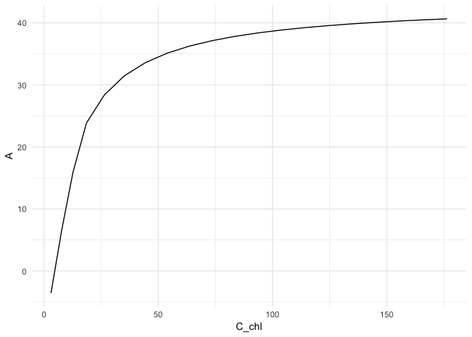

## Incorporating leaf temperature using **tealeaves**

In experiments, leaf temperature can be kept close to air temperature,
but in nature, leaf temperature can be quite a bit different than air
temperature in the shade depending on environmental and leaf parameters.
If `use_tealeaves = TRUE`, `photo()` and `photosynthesis()` will call on
the [**tealeaves**](https://CRAN.R-project.org/package=tealeaves)
package to calculate leaf temperature using an energy balance model.

``` r
# You will need to set use_tealeaves = TRUE when making parameters because additional parameters are needed for tealeaves.

bake_par <- make_bakepar()
constants  <- make_constants(use_tealeaves = TRUE)

enviro_par <- make_enviropar(
  replace = list(
    T_air = set_units(seq(288.15, 313.15, 1), K)
    ), use_tealeaves = TRUE
  )

leaf_par <- make_leafpar(replace = list(
    g_sc = set_units(c(2, 4), umol/m^2/s/Pa)
    ), use_tealeaves = TRUE
  )

ph <- photosynthesis(leaf_par, enviro_par, bake_par, constants, 
                     use_tealeaves = TRUE, progress = FALSE, 
                   quiet = TRUE, parallel = TRUE)

# Plot temperature and photosynthesis
library(ggplot2)

## Drop units for plotting
ph %<>% 
  mutate_if(~ is(.x, "units"), drop_units) %>%
  mutate(`g[s]` = ifelse(g_sc == 2, "low", "high"))

ggplot(ph, aes(T_air, T_leaf, color = `g[s]`)) +
  geom_line(size = 2, lineend = "round") +
  geom_abline(slope = 1, intercept = 0, linetype = "dotted") +
  scale_color_discrete(name = expression(g[s])) +
  xlab(expression(paste(T[air], " [K]"))) +
  ylab(expression(paste(T[leaf], " [K]"))) +
  theme_bw() +
  NULL
```

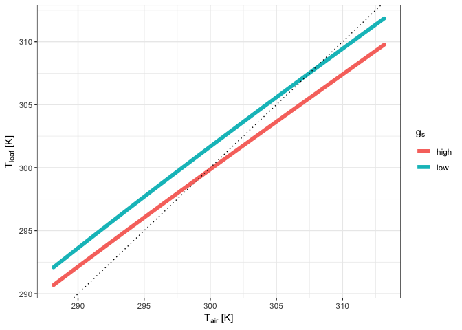

``` r
ggplot(ph, aes(T_air, A, color = `g[s]`)) +
  geom_line(size = 2, lineend = "round") +
  scale_color_discrete(name = expression(g[s])) +
  xlab(expression(paste(T[leaf], " [K]"))) +
  ylab(expression(paste("A [", mu, "mol ", m^-2~s^-1, "]"))) +
  theme_bw() +
  NULL
```

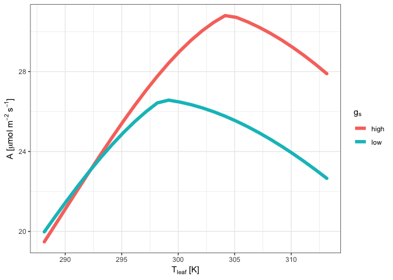

This vignette is designed to demonstrate how to use the curve fitting
and sensitivity analysis tools Sections are named based on the set of
methods to be used:

1.  Fitting light response curves

2.  Fitting CO2 response curves

3.  Fitting temperature response curves (Need data & to complete
    tutorial here)

4.  Fitting stomatal conductance models

5.  Fitting light respiration

6.  Fitting mesophyll conductance

7.  Fitting pressure-volume curves

8.  Fitting hydraulic vulnerability curves

9.  Sensitivity analyses (just need to think about measures of
    sensitivity & multi fits)

10. Dependency checking

Components under construction:

1.  Full Gu-type CO2 response fitting

2.  alphag fitting

3.  Busch et al (2018) CO2 response model

Within each section, data will either be generated or used from an
installed dataset within the package. For help with a given function,
please consult the help file via: ?functionname in the console. If you
want to know the fine details of the code, please go to:

<https://github.com/jstinzi/photosynthesis>

And look in the R folder to find the raw function files. These contain
heavily annotated code that explains the why and how of their operation.

\#Installing the package

You will need the following packages:

devtools - lets you install packages from Github and Bitbucket

minpack.lm - useful for nonlinear curve fitting that is more robust than
base R

tidyverse - set of tools for manipulating data within R

FOR WINDOWS USERS

You will need to install Rtools, available at:

<https://cran.r-project.org/bin/windows/Rtools/>

``` r
#To install, run the following without comments
#library(devtools)
#install_github("jstinzi/photosynthesis")

#Load package
library(photosynthesis)

#To cite, use:
citation("photosynthesis")
#> 
#> To cite photosynthesis in publications use:
#> 
#>   Stinziano JR, Roback C, Gamble D, Murphy B, Hudson P, Muir CD.
#>   (2020). photosynthesis: tools for plant ecophysiology & modeling. R
#>   package version 2.0.1.
#>   https://CRAN.R-project.org/package=photosynthesis.
#> 
#> A BibTeX entry for LaTeX users is
#> 
#>   @Misc{,
#>     title = {photosynthesis: tools for plant ecophysiology & modeling},
#>     author = {Joseph R Stinziano and Cassaundra Roback and Demi Gamble and Bridget Murphy and Patrick Hudson and Christopher D Muir},
#>     note = {R package version 2.0.1},
#>     year = {2020},
#>     url = {https://CRAN.R-project.org/package=photosynthesis},
#>   }

#Load tidyr - needed for vignette manipulations
library(tidyr)
```

\#Reading Li-Cor data

If you are trying to read in the raw data files of the Li-Cor 6400 or
6800 models, you can use the package RLicor by Erik Erhardt available on
Github.

``` r
#library(devtools)
#install_github("erikerhardt/RLicor")
#library(RLicor)

#The following will detect and read Li-Cor 6400 and 6800 files
#?read_Licor

#To cite, use:
#citation("RLicor")
```

\#1. Fitting light response curves

This package currently only implements the Marshall et al. 1980
non-rectangular hyperbola model of the photosynthetic light response.

``` r
#Read in your data
#Note that this data is coming from data supplied by the package
#hence the complicated argument in read.csv()
#This dataset is a CO2 by light response curve for a single sunflower
#Note that to read in your own data, you will need to delete the
#system.file() function, otherwise you will get an error
data <- read.csv(system.file("extdata", "A_Ci_Q_data_1.csv",
                             package = "photosynthesis"))

#Fit many AQ curves
#Set your grouping variable
#Here we are grouping by CO2_s and individual
data$C_s <-(round(data$CO2_s, digits = 0))

#For this example we need to round sequentially due to CO2_s setpoints
data$C_s <- as.factor(round(data$C_s, digits = -1))

#To fit one AQ curve
fit <- fit_aq_response(data[data$C_s == 600,],
                       varnames = list(A_net = "A",
                                         PPFD = "Qin",
                                       Q_cut = 250))

#Print model summary
summary(fit[[1]])
#> 
#> Formula: A_net ~ aq_response(k_sat, phi_J, Q_abs = data$Q_abs, theta_J) - 
#>     Rd
#> 
#> Parameters:
#>                 Estimate Std. Error t value Pr(>|t|)    
#> k_sat          21.167200   0.158332  133.69 1.88e-08 ***
#> phi_J.Q_abs     0.051907   0.001055   49.18 1.02e-06 ***
#> theta_J         0.775484   0.014920   51.98 8.20e-07 ***
#> Rd.(Intercept)  0.668495   0.065235   10.25 0.000511 ***
#> ---
#> Signif. codes:  0 '***' 0.001 '**' 0.01 '*' 0.05 '.' 0.1 ' ' 1
#> 
#> Residual standard error: 0.05535 on 4 degrees of freedom
#> 
#> Number of iterations to convergence: 5 
#> Achieved convergence tolerance: 1.49e-08

#Print fitted parameters
fit[[2]]
#>         A_sat      phi_J   theta_J        Rd      LCP  resid_SSs
#> k_sat 21.1672 0.05190746 0.7754836 0.6684953 12.97289 0.01225491

#Print graph
fit[[3]]
```

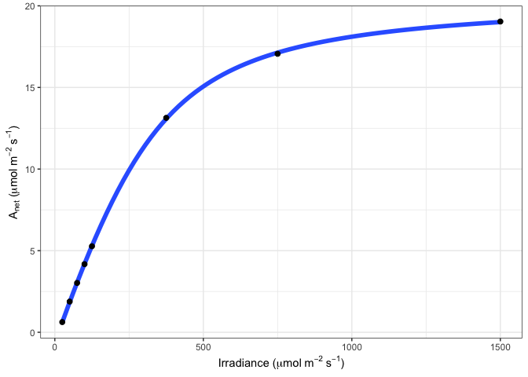

``` r
#Fit many curves
fits <- fit_many(data = data,
                 varnames = list(A_net = "A",
                                         PPFD = "Qin",
                                         group = "C_s"),
                 funct = fit_aq_response,
                 group = "C_s")
#>   |                                                                              |                                                                      |   0%  |                                                                              |========                                                              |  11%  |                                                                              |================                                                      |  22%  |                                                                              |=======================                                               |  33%  |                                                                              |===============================                                       |  44%  |                                                                              |=======================================                               |  56%  |                                                                              |===============================================                       |  67%  |                                                                              |======================================================                |  78%  |                                                                              |==============================================================        |  89%  |                                                                              |======================================================================| 100%

#Look at model summary for a given fit
#First set of double parentheses selects an individual group value
#Second set selects an element of the sublist
summary(fits[[3]][[1]])
#> 
#> Formula: A_net ~ aq_response(k_sat, phi_J, Q_abs = data$Q_abs, theta_J) - 
#>     Rd
#> 
#> Parameters:
#>                Estimate Std. Error t value Pr(>|t|)    
#> k_sat          7.347423   0.141931  51.768 8.33e-07 ***
#> phi_J.Q_abs    0.027192   0.001511  17.994 5.61e-05 ***
#> theta_J        0.837778   0.030608  27.371 1.06e-05 ***
#> Rd.(Intercept) 0.615283   0.086994   7.073  0.00211 ** 
#> ---
#> Signif. codes:  0 '***' 0.001 '**' 0.01 '*' 0.05 '.' 0.1 ' ' 1
#> 
#> Residual standard error: 0.06799 on 4 degrees of freedom
#> 
#> Number of iterations to convergence: 4 
#> Achieved convergence tolerance: 1.49e-08

#Print the parameters
fits[[2]][[2]]
#>          A_sat      phi_J   theta_J        Rd      LCP  resid_SSs
#> k_sat 2.637157 0.01458002 0.8858892 0.5951635 42.17813 0.02446394

#Print the graph
fits[[3]][[3]]
```

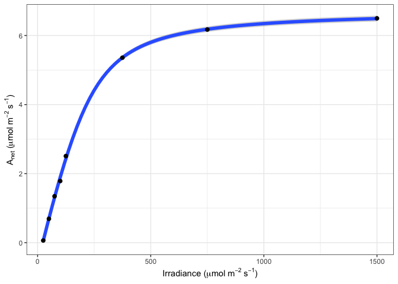

``` r
#Compile graphs into a list for plotting
fits_graphs <- compile_data(fits,
                            list_element = 3)

#Print graphs to jpeg
# print_graphs(data = fits_graphs,
#             path = tempdir(),
#             output_type = "jpeg")

#Compile parameters into dataframe for analysis
fits_pars <- compile_data(fits,
                          output_type = "dataframe",
                          list_element = 2)
```

\#2. Fitting CO2 response curves

This package currently implements a Gu-type fitting procedure for CO2
response curves similar to the Duursma (2015) implementation. There is
ongoing work to implement a full Gu-type method whereby mesophyll
conductance, Km, and GammaStar could all be fit (Gu et al 2010). There
is also ongoing work to implement a procedure to fit alphag for the
TPU-limited region and to incorporate the Sharkey (2019) suggestion of
using chlorophyll fluorescence data to inform TPU limitations.

``` r
#Read in your data
#Note that this data is coming from data supplied by the package
#hence the complicated argument in read.csv()
#This dataset is a CO2 by light response curve for a single sunflower
data <- read.csv(system.file("extdata", "A_Ci_Q_data_1.csv", 
                             package = "photosynthesis"))

#Define a grouping factor based on light intensity to split the ACi
#curves
data$Q_2 <- as.factor((round(data$Qin, digits = 0)))

#Convert data temperature to K
data$T_leaf <- data$Tleaf + 273.15

#Fit ACi curve. Note that we are subsetting the dataframe
#here to fit for a single value of Q_2
fit <- fit_aci_response(data[data$Q_2 == 1500, ],
                        varnames = list(A_net = "A",
                                      T_leaf = "T_leaf",
                                      C_i = "Ci",
                                      PPFD = "Qin"))

#View fitted parameters
fit[[1]]
#>   Num V_cmax V_cmax_se    J_max        J      J_se V_TPU V_TPU_se        R_d
#> 6   0 62.797  2.176227 110.3051 103.9718 0.1847135  1000       NA -0.3470509
#>      R_d_se     cost citransition1 citransition2 V_cmax_pts J_max_pts V_TPU_pts
#> 6 0.3947545 1.063979      427.6839      1450.485          8         4         0
#>   alpha alpha_g gamma_star25 Ea_gamma_star K_M25   Ea_K_M  g_mc25 Ea_g_mc Oconc
#> 6  0.24       0        42.75         37830 718.4 65508.28 0.08701       0    21
#>   theta_J
#> 6    0.85

#View graph
fit[[2]]
```

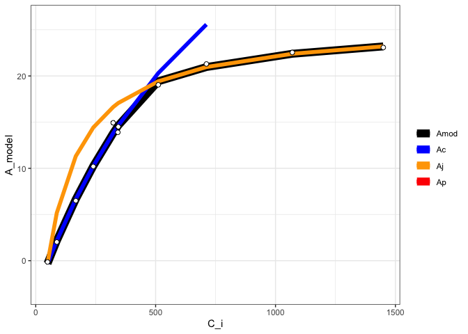

``` r
#View data with modeled parameters attached
#fit[[3]]

#Fit many curves
fits <- fit_many(data = data,
                 varnames = list(A_net = "A",
                                      T_leaf = "T_leaf",
                                      C_i = "Ci",
                                      PPFD = "Qin"),
                 funct = fit_aci_response,
                 group = "Q_2")
#>   |                                                                              |                                                                      |   0%  |                                                                              |=========                                                             |  12%  |                                                                              |==================                                                    |  25%  |                                                                              |==========================                                            |  38%  |                                                                              |===================================                                   |  50%  |                                                                              |============================================                          |  62%  |                                                                              |====================================================                  |  75%  |                                                                              |=============================================================         |  88%  |                                                                              |======================================================================| 100%

#Print the parameters
#First set of double parentheses selects an individual group value
#Second set selects an element of the sublist
fits[[3]][[1]]
#>   Num  V_cmax V_cmax_se    J_max        J       J_se V_TPU V_TPU_se        R_d
#> 6   0 8.94862 0.5509706 47.01527 16.63315 0.08692268  1000       NA -0.1565895
#>      R_d_se      cost citransition1 citransition2 V_cmax_pts J_max_pts
#> 6 0.1264438 0.1194886      441.2967      1442.493          8         4
#>   V_TPU_pts alpha alpha_g gamma_star25 Ea_gamma_star K_M25   Ea_K_M  g_mc25
#> 6         0  0.24       0        42.75         37830 718.4 65508.28 0.08701
#>   Ea_g_mc Oconc theta_J
#> 6       0    21    0.85

#Print the graph
fits[[3]][[2]]
```

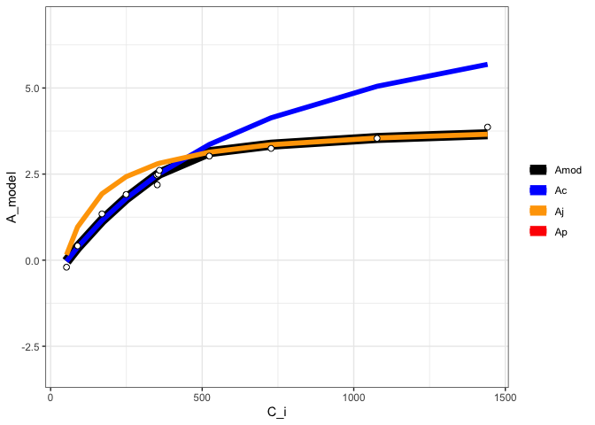

``` r
#Compile graphs into a list for plotting
fits_graphs <- compile_data(fits,
                            list_element = 2)

#Print graphs to jpeg
# print_graphs(data = fits_graphs,
#             path = tempdir(),
#             output_type = "jpeg")

#Compile parameters into dataframe for analysis
fits_pars <- compile_data(fits,
                          output_type = "dataframe",
                          list_element = 1)
```

\#3. Fitting temperature response curves

This package provides support for multiple temperature response
functions (Arrhenius 1915; Medlyn et al. 2002; Kruse & Adams. 2006;
Heskel et al. 2016; Liang et al. 2018).

``` r
#Read in data
data <- read.csv(system.file("extdata", "A_Ci_T_data.csv", 
                             package = "photosynthesis"),
                 stringsAsFactors = FALSE)

#Round temperatures to group them appropriately
#Use sequential rounding
data$T2 <- round(data$Tleaf, 1)
data$T2 <- round(data$Tleaf, 0)

#Look at unique values to detect rounding issues
unique(data$T2)
#>  [1] 17 18 20 22 23 25 28 27 30 33 32 35 37 38 40

#Some still did not round correctly,
#manually correct
for(i in 1:nrow(data)){
  if(data$T2[i] == 18){
    data$T2[i] <- 17
  }
  if(data$T2[i] == 23){
    data$T2[i] <- 22
  }
  if(data$T2[i] == 28){
    data$T2[i] <- 27
  }
  if(data$T2[i] == 33){
    data$T2[i] <- 32
  }
  if(data$T2[i] == 38){
    data$T2[i] <- 37
  }
}

#Make sure it is a character string for grouping
data$T2 <- as.character(data$T2)

#Create grouping variable by ID and measurement temperature
data <- unite(data, col = "ID2", c("ID", "T2"),
                 sep = "_")

#Split by temperature group
data <- split(data, data$ID2)

#Obtain mean temperature for group so temperature
#response fitting is acceptable later, round to
#2 decimal places
for(i in 1:length(data)){
  data[[i]]$Curve_Tleaf <- round(mean(data[[i]]$Tleaf), 2)
}

#Convert from list back to dataframe
data <- do.call("rbind", data)

#Parse grouping variable by ID and measurement temperature
data <- separate(data, col = "ID2", into = c("ID", "T2"),
                 sep = "_")

#Make sure number of values matches number of measurement
#temperatures. May vary slightly if plants had slightly
#different leaf temperatures during the measurements
unique(data$Curve_Tleaf)
#>  [1] 17.51 20.01 22.50 25.01 27.51 30.01 32.50 34.99 37.50 39.99 20.00 22.51
#> [13] 25.02 40.01

#Create ID column to curve fit by ID and temperature
data <- unite(data, col = "ID2", c("ID", "Curve_Tleaf"),
                 sep = "_")

#Convert data temperature to K
data$T_leaf <- data$Tleaf + 273.15

#Fit many CO2 response curves
fits2 <- fit_many(data = data,
                 group = "ID2",
                 varnames = list(A_net = "A",
                                 C_i = "Ci",
                                 T_leaf = "T_leaf",
                                 PPFD = "Qin",
                                 g_mc = "g_mc"),
                 funct = fit_aci_response,
                 alphag = 0)
#>   |                                                                              |                                                                      |   0%  |                                                                              |====                                                                  |   5%  |                                                                              |=======                                                               |  10%  |                                                                              |==========                                                            |  15%  |                                                                              |==============                                                        |  20%  |                                                                              |==================                                                    |  25%  |                                                                              |=====================                                                 |  30%  |                                                                              |========================                                              |  35%  |                                                                              |============================                                          |  40%  |                                                                              |================================                                      |  45%  |                                                                              |===================================                                   |  50%  |                                                                              |======================================                                |  55%  |                                                                              |==========================================                            |  60%  |                                                                              |==============================================                        |  65%  |                                                                              |=================================================                     |  70%  |                                                                              |====================================================                  |  75%  |                                                                              |========================================================              |  80%  |                                                                              |============================================================          |  85%  |                                                                              |===============================================================       |  90%  |                                                                              |==================================================================    |  95%  |                                                                              |======================================================================| 100%

#Extract ACi parameters
pars <- compile_data(fits2, output_type = "dataframe",
                     list_element = 1)

#Extract ACi graphs
graphs <- compile_data(fits2, output_type = "list",
                     list_element = 2)

#Parse the ID variable
pars <- separate(pars, col = "ID", into = c("ID", "Curve_Tleaf"), sep = "_")

#Make sure curve leaf temperature is numeric
pars$Curve_Tleaf <- as.numeric(pars$Curve_Tleaf)
pars$T_leaf <- pars$Curve_Tleaf + 273.15
out <- fit_t_response(data = pars[pars$ID == "S2",],
                      varnames = list(Par = "V_cmax",
                                      T_leaf = "T_leaf"),
                      setvar = "Hd")

out[["Arrhenius"]][["Graph"]]
```

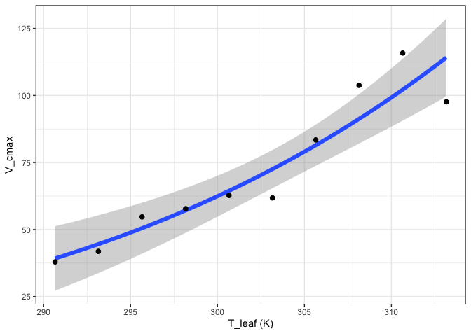

``` r
out[["Heskel"]][["Graph"]]
```


``` r
out[["Kruse"]][["Graph"]]
```


``` r
out[["Medlyn"]][["Graph"]]
```

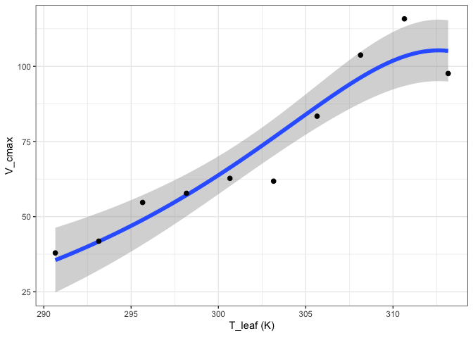

``` r
out[["MMRT"]][["Graph"]]
```

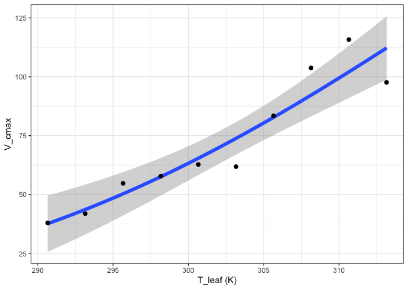

``` r
out[["Quadratic"]][["Graph"]]
```

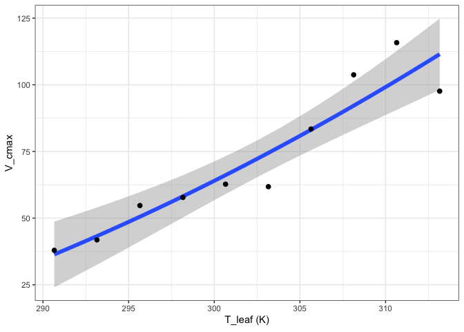

``` r
out[["Topt"]][["Graph"]]
```

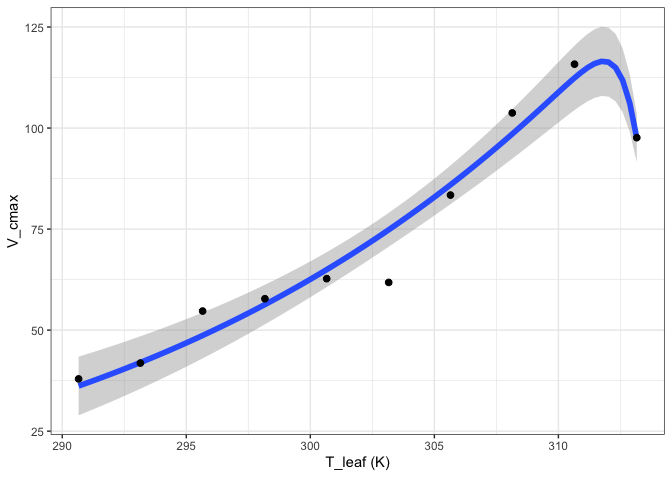

\#4. Fitting stomatal conductance models

The package currently supports three varieties of stomatal conductance
models (Ball et al. 1987; Leuning 1995; Medlyn et al. 2011).

``` r
#Read in your data
#Note that this data is coming from data supplied by the package
#hence the complicated argument in read.csv()
#This dataset is a CO2 by light response curve for a single sunflower
data <- read.csv(system.file("extdata", "A_Ci_Q_data_1.csv", 
                             package = "photosynthesis"))

#Convert RH to a proportion
data$RH <- data$RHcham / 100

#Fit stomatal conductance models
#Can specify a single model, or all as below
fits <- fit_gs_model(data = data,
                     varnames = list(A_net = "A",
                                     C_air = "Ca",
                                     g_sw = "gsw",
                                     RH = "RH",
                                     VPD = "VPDleaf"),
                     model = c("BallBerry",
                               "Leuning",
                               "Medlyn_partial",
                               "Medlyn_full"),
                         D0 = 3)

#Look at BallBerry model summary:
summary(fits[["BallBerry"]][["Model"]])
#> 
#> Call:
#> lm(formula = g_sw ~ gs_mod_ballberry(A_net = A_net, C_air = C_air, 
#>     RH = RH), data = data)
#> 
#> Residuals:
#>     Min      1Q  Median      3Q     Max 
#> -0.1516 -0.1007 -0.0557  0.1372  0.2498 
#> 
#> Coefficients:
#>                                                          Estimate Std. Error
#> (Intercept)                                             1.481e-01  1.471e-02
#> gs_mod_ballberry(A_net = A_net, C_air = C_air, RH = RH) 1.627e-05  2.832e-06
#>                                                         t value Pr(>|t|)    
#> (Intercept)                                              10.062  < 2e-16 ***
#> gs_mod_ballberry(A_net = A_net, C_air = C_air, RH = RH)   5.744 1.13e-07 ***
#> ---
#> Signif. codes:  0 '***' 0.001 '**' 0.01 '*' 0.05 '.' 0.1 ' ' 1
#> 
#> Residual standard error: 0.1248 on 94 degrees of freedom
#> Multiple R-squared:  0.2598, Adjusted R-squared:  0.2519 
#> F-statistic: 32.99 on 1 and 94 DF,  p-value: 1.132e-07

#Look at BallBerry parameters
fits[["BallBerry"]][["Parameters"]]
#>          g0          g1
#> 1 0.1480627 1.62664e-05

#Look at BallBerry plot
fits[["BallBerry"]][["Graph"]]
```

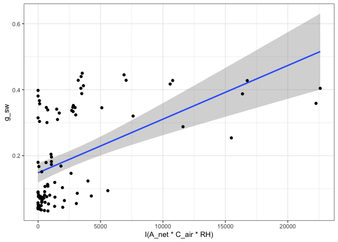

``` r

#Fit many g_sw models
#Set your grouping variable
#Here we are grouping by Qin and individual
data$Q_2 <- as.factor((round(data$Qin, digits = 0)))

fits <- fit_many(data,
                 varnames = list(A_net = "A",
                                 C_air = "Ca",
                                 g_sw = "gsw",
                                 RH = "RH",
                                 VPD = "VPDleaf"),
                 funct = fit_gs_model,
                 group = "Q_2")
#>   |                                                                              |                                                                      |   0%Error in nlsModel(formula, mf, start, wts) : 
#>   singular gradient matrix at initial parameter estimates
#>   |                                                                              |=========                                                             |  12%  |                                                                              |==================                                                    |  25%  |                                                                              |==========================                                            |  38%  |                                                                              |===================================                                   |  50%  |                                                                              |============================================                          |  62%  |                                                                              |====================================================                  |  75%  |                                                                              |=============================================================         |  88%  |                                                                              |======================================================================| 100%

#Look at the Medlyn_partial outputs at 750 PAR
#Model summary
summary(fits[["750"]][["Medlyn_partial"]][["Model"]])
#> 
#> Formula: g_sw ~ gs_mod_opti(A_net = A_net, C_air = C_air, VPD = VPD, g0, 
#>     g1)
#> 
#> Parameters:
#>    Estimate Std. Error t value Pr(>|t|)    
#> g0  0.38778    0.03317  11.692 3.73e-07 ***
#> g1 -1.09754    0.83022  -1.322    0.216    
#> ---
#> Signif. codes:  0 '***' 0.001 '**' 0.01 '*' 0.05 '.' 0.1 ' ' 1
#> 
#> Residual standard error: 0.04375 on 10 degrees of freedom
#> 
#> Number of iterations to convergence: 2 
#> Achieved convergence tolerance: 1.49e-08

#Model parameters
fits[["750"]][["Medlyn_partial"]][["Parameters"]]
#>          g0        g1
#> 1 0.3877773 -1.097544

#Graph
fits[["750"]][["Medlyn_partial"]][["Graph"]]
```

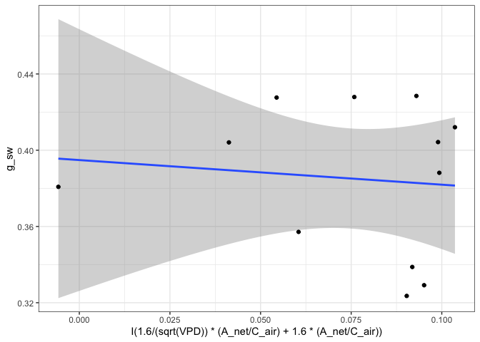

``` r
#Compile parameter outputs for BallBerry model
#Note that it's the first element for each PAR value
#First compile list of BallBerry fits
bbmods <- compile_data(data = fits,
                     output_type = "list",
                     list_element = 1)
#Now compile the parameters (2nd element) into a dataframe
bbpars <- compile_data(data = bbmods,
                     output_type = "dataframe",
                     list_element = 2)

#Convert group variable back to numeric
bbpars$ID <- as.numeric(bbpars$ID)

#Take quick look at light response of intercept parameters
plot(g0 ~ ID, bbpars)
```

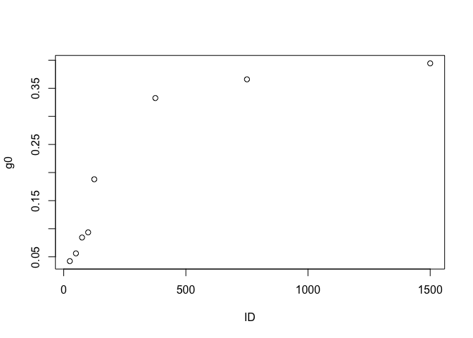

``` r
#Compile graphs
graphs <- compile_data(data = bbmods,
                       output_type = "list",
                       list_element = 3)

#Look at 3rd graph
graphs[[3]]
```

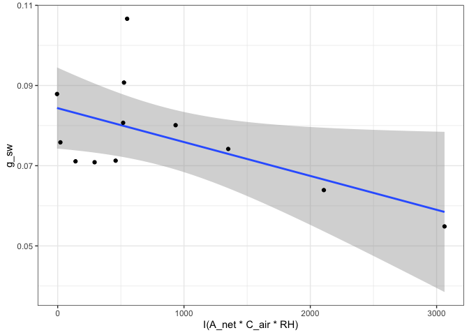

\#5. Fitting light respiration

The package currently supports fitting light respiration according to
the slope-intercept regression extension of the Laisk method (Laisk
1977; Walker & Ort 2015), the Kok method (Kok 1956), and the Yin
modification of the Kok method (Yin et al. 2009, 2011)

``` r
#Read in your data
#Note that this data is coming from data supplied by the package
#hence the complicated argument in read.csv()
#This dataset is a CO2 by light response curve for a single sunflower
data <- read.csv(system.file("extdata", "A_Ci_Q_data_1.csv", 
                             package = "photosynthesis"))

#Fit light respiration with Yin method
r_light <- fit_r_light_yin(data = data,
                           varnames = list(A_net = "A",
                                           PPFD = "Qin",
                                           phi_PSII = "PhiPS2"),
                           PPFD_lower = 20,
                           PPFD_upper = 250)

#Fit light respiration with Kok method
r_light <- fit_r_light_kok(data = data,
                           varnames = list(A_net = "A",
                                           PPFD = "Qin"),
                           PPFD_lower = 20,
                           PPFD_upper = 150)

#Set your grouping variable
#Here we are grouping by CO2_s and individual
data$C_s <-(round(data$CO2_s, digits = 0))

#For this example we need to round sequentially due to CO2_s setpoints
data$C_s <- as.factor(round(data$C_s, digits = -1))

#Fit light respiration across groups with Yin method
r_lights <- fit_many(data = data,
                     funct = fit_r_light_yin,
                     group = "C_s",
                     varnames = list(A_net = "A",
                                           PPFD = "Qin",
                                           phi_PSII = "PhiPS2"),
                           PPFD_lower = 20,
                           PPFD_upper = 250)
#>   |                                                                              |                                                                      |   0%  |                                                                              |========                                                              |  11%  |                                                                              |================                                                      |  22%  |                                                                              |=======================                                               |  33%  |                                                                              |===============================                                       |  44%  |                                                                              |=======================================                               |  56%  |                                                                              |===============================================                       |  67%  |                                                                              |======================================================                |  78%  |                                                                              |==============================================================        |  89%  |                                                                              |======================================================================| 100%

#Compile the outputs - note this is slightly more complex because the
#output of the fit_many above is a list of atomic vectors, not dataframes.
group <- names(r_lights)
r_lights <- do.call("c", r_lights)
r_light_yin <- data.frame(x = group, y = r_lights, stringsAsFactors = FALSE)
r_light_yin$x <- as.numeric(r_light_yin$x)
colnames(r_light_yin) <- c("C_s", "r_light")

#Fit the Walker-Ort method for GammaStar and light respiration
walker_ort <- fit_r_light_WalkerOrt(data,
                      varnames = list(A_net = "A",
                                      C_i = "Ci",
                                      PPFD = "Qin"))

#View model output
summary(walker_ort[[1]])
#> 
#> Call:
#> lm(formula = Intercept ~ Slope, data = coefs)
#> 
#> Residuals:
#>      Min       1Q   Median       3Q      Max 
#> -0.36114 -0.10958 -0.05553  0.08166  0.62016 
#> 
#> Coefficients:
#>             Estimate Std. Error t value Pr(>|t|)    
#> (Intercept)  -0.1526     0.1176  -1.297    0.224    
#> Slope        -4.6004     0.4069 -11.307  5.1e-07 ***
#> ---
#> Signif. codes:  0 '***' 0.001 '**' 0.01 '*' 0.05 '.' 0.1 ' ' 1
#> 
#> Residual standard error: 0.2513 on 10 degrees of freedom
#> Multiple R-squared:  0.9275, Adjusted R-squared:  0.9202 
#> F-statistic: 127.8 on 1 and 10 DF,  p-value: 5.103e-07

#View graph
walker_ort[[2]]
```

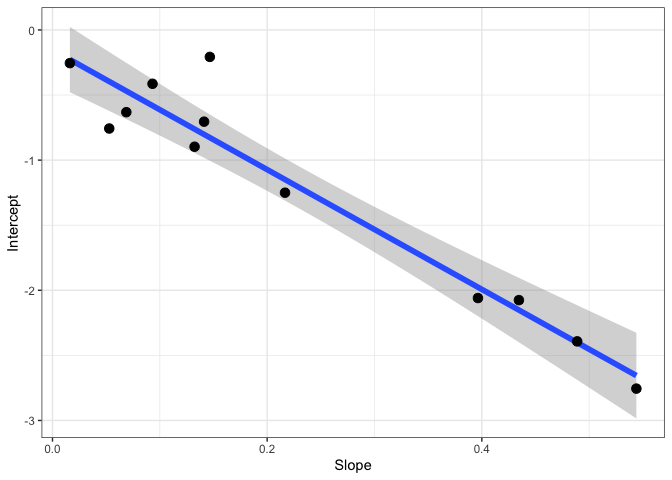

``` r
#View coeffients
walker_ort[[3]]
#>       GammaStar   r_light
#> Slope  46.00427 -0.152643
```

\#6. Fitting mesophyll conductance

Currently there is only support for fitting mesophyll conductance
according to the variable J method from Harley et al. 1992

``` r
#Read in your data
#Note that this data is coming from data supplied by the package
#hence the complicated argument in read.csv()
#This dataset is a CO2 by light response curve for a single sunflower
data <- read.csv(system.file("extdata", "A_Ci_Q_data_1.csv", 
                             package = "photosynthesis"))

#Note: there will be issues here if the alpha value used
#for calculating ETR is off, if GammaStar is incorrect,
#if Rd is incorrect.
data <- fit_g_mc_variableJ(data,
                         varnames = list(A_net = "A",
                                         J_etr = "ETR",
                                         C_i = "Ci",
                                         PPFD = "Qin",
                                         phi_PSII = "PhiPS2"),
                                         gamma_star = 46,
                                         R_d = 0.153,
                         usealpha_Q = TRUE,
                         alpha_Q = 0.84,
                         beta_Q = 0.5,
                         P = 84)

#Note that many g_mc values from this method can be unreliable
ggplot(data, aes(x = CO2_s, y = g_mc, colour = reliable)) +
  labs(x = expression(CO[2]~"("*mu*mol~mol^{-1}*")"),
       y = expression(g[m]~"(mol"~m^{-2}~s^{-1}~Pa^{-1}*")")) +
  geom_point(size = 2) +
  theme_bw() +
  theme(legend.position = 'bottom')
```

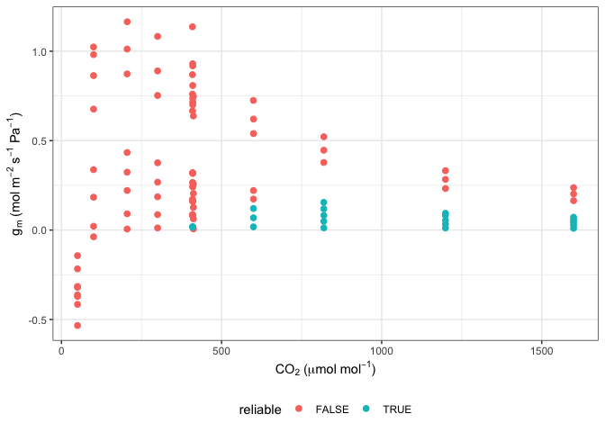

``` r
#Plot QAQC graph according to Harley et al. 1992
ggplot(data, aes(x = CO2_s, y = dCcdA, colour = reliable)) +
  labs(x = expression(CO[2]~"("*mu*mol~mol^{-1}*")"),
       y = expression(delta*C[c]*"/"*delta*A)) +
  geom_hline(yintercept = 10) +
  geom_point(size = 2) +
  theme_bw() +
  theme(legend.position = 'bottom')
```

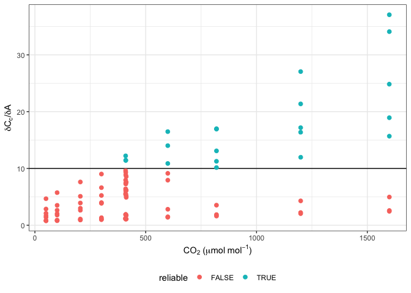

``` r
ggplot(data, aes(x = dCcdA, y = g_mc, colour = reliable)) +
  labs(x = expression(delta*C[c]*"/"*delta*A),
       y = expression(g[m]~"(mol"~m^{-2}~s^{-1}~Pa^{-1}*")")) +
  geom_point(size = 2) +
  theme_bw() +
  theme(legend.position = 'bottom')
```

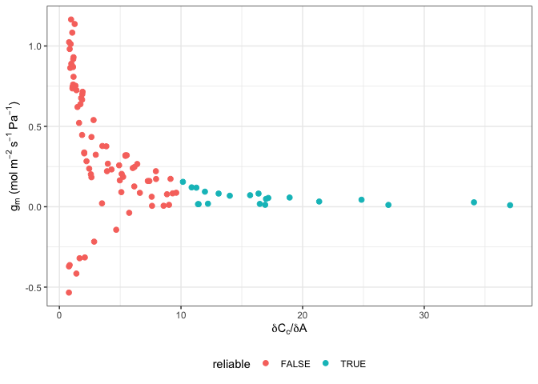

\#7. Fitting pressure-volume curves

This package follows the Prometheus wiki spreadsheet from Sack and
Pasquet-Kok at:

<http://prometheuswiki.org/tiki-index.php?page=Leaf+pressure-volume+curve+parameters>.

For references, see Koide et al. 2000, Sack et al. 2003, and Tyree &
Hammel 1972.

``` r
#Read in data
data <- read.csv(system.file("extdata", "PV_curve.csv", 
                             package = "photosynthesis"))

#Fit one PV curve
fit <- fit_PV_curve(data[data$ID == "L2", ],
                    varnames = list(psi = "psi", 
                                    mass = "mass", 
                                    leaf_mass = "leaf_mass", 
                                    bag_mass = "bag_mass", 
                                    leaf_area = "leaf_area"))

#See fitted parameters
fit[[1]]
#>        SWC      PI_o psi_TLP  RWC_TLP      eps       C_FT      C_TLP  C_FTStar
#> 1 2.438935 -1.399302   -1.75 88.67684 12.20175 0.06456207 0.09923338 0.5161476

#Plot water mass graph
fit[[2]]
```


``` r
#Plot PV Curve
fit[[3]]
```

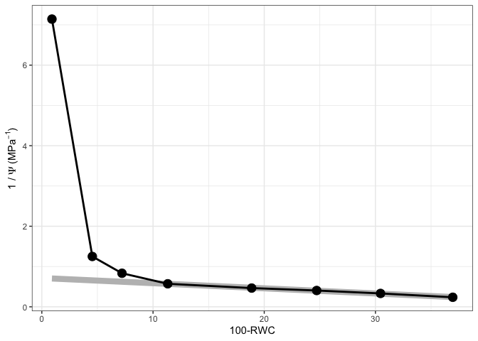

``` r
#Fit all PV curves in a file
fits <- fit_many(data,
                 group = "ID",
                 funct = fit_PV_curve,
                 varnames = list(psi = "psi", 
                                    mass = "mass", 
                                    leaf_mass = "leaf_mass", 
                                    bag_mass = "bag_mass", 
                                    leaf_area = "leaf_area"))
#>   |                                                                              |                                                                      |   0%  |                                                                              |=======================                                               |  33%  |                                                                              |===============================================                       |  67%  |                                                                              |======================================================================| 100%

#See parameters
fits[[1]][[1]]
#>        SWC      PI_o psi_TLP  RWC_TLP      eps       C_FT      C_TLP  C_FTStar
#> 1 2.438935 -1.399302   -1.75 88.67684 12.20175 0.06456207 0.09923338 0.5161476

#See water mass - water potential graph
fits[[1]][[2]]
```

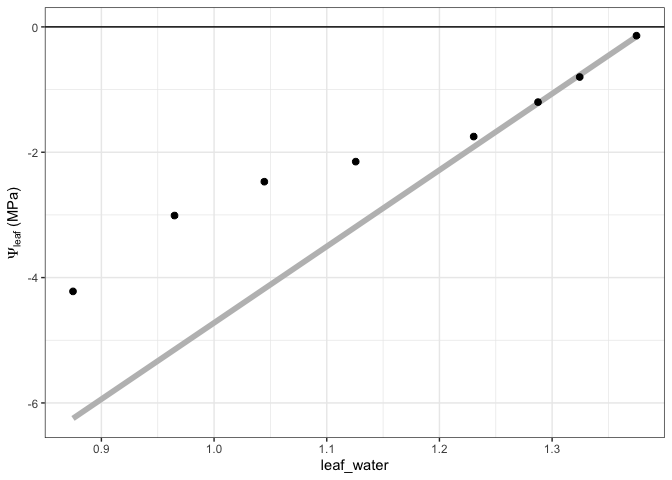

``` r
#See PV curve
fits[[1]][[3]]
```


``` r
#Compile parameter outputs
pars <- compile_data(data = fits,
                     output_type = "dataframe",
                     list_element = 1)

#Compile the water mass - water potential graphs
graphs1 <- compile_data(data = fits,
                     output_type = "list",
                     list_element = 2)

#Compile the PV graphs
graphs2 <- compile_data(data = fits,
                     output_type = "list",
                     list_element = 3)
```

\#8. Fitting hydraulic vulnerability curves

Current approach fits a sigmoidal model and calculates hydraulic
parameters from the curve fit. See Pammenter & Van der Willigen, 1998
and Ogle et al. 2009.

``` r
#Read in data
data <- read.csv(system.file("extdata", "hydraulic_vulnerability.csv", 
                             package = "photosynthesis"))

#Fit hydraulic vulnerability curve
fit <- fit_hydra_vuln_curve(data[data$Tree == 5 & data$Plot == "Irrigation",],
                            varnames = list(psi = "P",
                                            PLC = "PLC"),
                            start_weibull = list(a = 2, b = 1),
                            title = "Irrigation 5")

#Return Sigmoidal model summary
summary(fit[[1]]) 
#> 
#> Call:
#> lm(formula = H_log ~ psi, data = data[data$H_log < Inf, ])
#> 
#> Residuals:
#>       14       15       16       17       18 
#>  0.40236 -0.63441  0.01791  0.09292  0.12121 
#> 
#> Coefficients:
#>             Estimate Std. Error t value Pr(>|t|)   
#> (Intercept)   5.1700     0.5344   9.675  0.00234 **
#> psi          -1.0884     0.1212  -8.982  0.00291 **
#> ---
#> Signif. codes:  0 '***' 0.001 '**' 0.01 '*' 0.05 '.' 0.1 ' ' 1
#> 
#> Residual standard error: 0.4427 on 3 degrees of freedom
#> Multiple R-squared:  0.9642, Adjusted R-squared:  0.9522 
#> F-statistic: 80.68 on 1 and 3 DF,  p-value: 0.002912

#Return Weibull model summary
summary(fit[[4]]) #expecting a = 4.99, b = 3.22
#> 
#> Formula: K.Kmax ~ exp(-((psi/a)^b))
#> 
#> Parameters:
#>   Estimate Std. Error t value Pr(>|t|)    
#> a   5.3160     0.0902   58.93 4.96e-07 ***
#> b   2.7778     0.2393   11.61 0.000315 ***
#> ---
#> Signif. codes:  0 '***' 0.001 '**' 0.01 '*' 0.05 '.' 0.1 ' ' 1
#> 
#> Residual standard error: 0.02867 on 4 degrees of freedom
#> 
#> Number of iterations to convergence: 8 
#> Achieved convergence tolerance: 1.49e-08

#Return model parameters with 95% confidence intervals
fit[[2]] 
#>           Value Parameter     Curve
#> b...1  4.749922         b Sigmoidal
#> a...2 -1.088445         a Sigmoidal
#> b...3  2.777799         b   Weibull
#> a...4  5.315979         a   Weibull

#Return hydraulic parameters
fit[[3]] 
#>        P25      P50      P88      P95      S50       Pe     Pmax      DSI
#> 1 3.740581 4.749922 6.580451 7.455102 27.21113 2.912439 6.587406 3.674967
#> 2 3.394637 4.658873 6.967591 7.890836 20.66405 2.239211 7.078534 4.839322
#>       Curve
#> 1 Sigmoidal
#> 2   Weibull

#Return graph
#fit[[5]] 

data <- unite(data, col = "ID", c("Plot", "Tree"), sep = "_")
#fit many function check to make sure it works for weibull
#Fit many curves
fits <- fit_many(data = data,
                  varnames = list(psi = "P",
                                            PLC = "PLC"),
                 group = "ID",
                 start_weibull = list(a = 4, b = 2),
                  #group = "Tree",
                  funct = fit_hydra_vuln_curve)
#>   |                                                                              |                                                                      |   0%  |                                                                              |========                                                              |  11%  |                                                                              |================                                                      |  22%  |                                                                              |=======================                                               |  33%  |                                                                              |===============================                                       |  44%  |                                                                              |=======================================                               |  56%  |                                                                              |===============================================                       |  67%  |                                                                              |======================================================                |  78%  |                                                                              |==============================================================        |  89%  |                                                                              |======================================================================| 100%

#To select individuals from the many fits
#Return model summary
summary(fits[[1]][[1]]) #Returns model summary
#> 
#> Call:
#> lm(formula = H_log ~ psi, data = data[data$H_log < Inf, ])
#> 
#> Residuals:
#>       44       45       46       47       48 
#> -0.15427  0.06136  0.23623  0.20568 -0.34900 
#> 
#> Coefficients:
#>             Estimate Std. Error t value Pr(>|t|)    
#> (Intercept)  5.72729    0.34666   16.52 0.000483 ***
#> psi         -1.41591    0.07861  -18.01 0.000373 ***
#> ---
#> Signif. codes:  0 '***' 0.001 '**' 0.01 '*' 0.05 '.' 0.1 ' ' 1
#> 
#> Residual standard error: 0.2872 on 3 degrees of freedom
#> Multiple R-squared:  0.9908, Adjusted R-squared:  0.9878 
#> F-statistic: 324.4 on 1 and 3 DF,  p-value: 0.0003733

#Return sigmoidal model output
fits[[1]][[2]] 
#>           Value Parameter     Curve
#> b...1  4.044964         b Sigmoidal
#> a...2 -1.415905         a Sigmoidal
#> b...3  3.905565         b   Weibull
#> a...4  4.580836         a   Weibull

#Return hydraulic parameters
fits[[1]][[3]] 
#>        P25      P50      P88      P95      S50       Pe     Pmax      DSI
#> 1 3.269056 4.044964 5.452141 6.124509 35.39764 2.632440 5.457488 2.825047
#> 2 3.329677 4.170508 5.552841 6.066678 32.45566 2.629945 5.711071 3.081127
#>       Curve
#> 1 Sigmoidal
#> 2   Weibull

#Return graph
fits[[1]][[5]] 
```

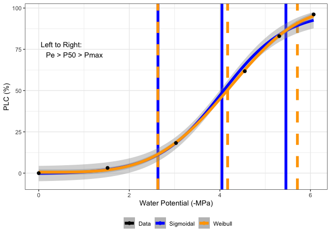

``` r
#Compile parameter outputs
pars <- compile_data(data = fits,
                     output_type = "dataframe",
                     list_element = 3)

#Compile graphs
graphs <- compile_data(data = fits,
                     output_type = "list",
                     list_element = 5)
```

\#9. Sensitivity analyses

This segment outlines a set of functions that can be used to assess the
sensitivity of data outputs to assumed parameters. For example, assuming
different values of GammaStar, mesophyll conductance, and light
absorbance on fitted gas exchange parameters.

Uncomment the chunk below to run - it takes awhile. \#\`\`\`{r} \#Read
in your data \#Note that this data is coming from data supplied by the
package \#hence the complicated argument in read.csv() \#This dataset is
a CO2 by light response curve for a single sunflower data \<-
read.csv(system.file(“extdata”, “A_Ci_Q\_data_1.csv”, package =
“photosynthesis”))

\#Define a grouping factor based on light intensity to split the ACi
\#curves
dataQin,
digits = 0)))

\#Convert data temperature to K
dataTleaf +
273.15

\#Run a sensitivity analysis on GammaStar and mesophyll conductance \#at
25 Celsius for one individual curve pars \<- analyze_sensitivity(data =
data\[data$Q_2 == 1500, \], funct = fit_aci_response, varnames =
list(A_net = “A”, T_leaf = “T_leaf”, C_i = “Ci”, PPFD = “Qin”), useg_mct
= TRUE, test1 = “gamma_star25”, element_out = 1, test2 = “g_mc25”,
fitTPU = TRUE, Ea_gamma_star = 0, Ea_g\_mc = 0, values1 = seq(from = 20,
to = 60, by = 4), values2 = seq(from = 0.2, to = 2, by = 0.1))

\#Compute measures of sensitivity par2 \<- compute_sensitivity(data =
pars, varnames = list(Par = “V_cmax”, test1 = “gamma_star25”, test2 =
“g_mc25”), test1_ref = 40, test2_ref = 1) \#Plot sensitivity
ggplot(par2, aes(y = CE_gamma_star25, x = CE_g\_mc25, colour = V_cmax))+
labs(x = expression(g_mc\[25\]\~“Control Coefficient”), y =
expression(Gamma\[25\]\~“Control Coefficient”)) + geom_point() +
theme_bw()

ggplot(par2, aes(y = CE_gamma_star25, x = V_cmax, colour =
gamma_star25))+ geom_point() + theme_bw() \#Note that in this case a
missing point appears due to an infinity \#Can also plot sensitivity
measures in 2 dimensions ggplot(par2, aes(x = gamma_star25, y = g_mc25,
z = CE_gamma_star25))+ geom_tile(aes(fill = CE_gamma_star25)) + labs(x =
expression(Gamma*“*”\[25\]<sub>”(”*mu*mol</sub>mol^{-1}*”)“), y =
expression(g\[m\]\[25\]<sub>“(”*mu*mol</sub>m<sup>{-2}\~s</sup>{-1}\~Pa^{-1}*”)“))+
scale_fill_distiller(palette =”Greys”) + geom_contour(colour = “Black”,
size = 1) + theme_bw()

plot(PE_gamma_star25 \~ gamma_star25, par2) \#\`\`\`

\#10. Dependency checking

A function can be used to generate an html file that assesses the
dependencies within and between packages

``` r
#check_dependencies()
```

\#References

Arrhenius S. 1915. Quantitative laws in biological chemistry. Bell.

Ball JT, Woodrow IE, Berry JA. 1987. A model predicting stomatal
conductance and its contribution to the control of photosynthesis under
different environmental conditions, in Progress in Photosynthesis
Research, Proceedings of the VII International Congress on
Photosynthesis, vol. 4, edited by I. Biggins, pp.  221–224, Martinus
Nijhoff, Dordrecht, Netherlands.

Duursma R. 2015. Plantecophys - an R package for analysing and modeling
leaf gas exchange data. PLoS ONE 10:e0143346

Erhardt EB. 2019. RLicor: Read Licor files. R package version 0.0.01.

Gu L, Pallardy SG, Tu K, Law BE, Wullschleger SD. 2010. Reliable
estimation of biochemical parameters from C3 leaf photosynthesis-
intercellular carbon dioxide response curves. Plant Cell Environ
33:1582-1874.

Harley PC, Loreto F, Di Marco G, Sharkey TD. 1992. Theoretical
considerations when estimating mesophyll conductance to CO2 flux by
analysis of the response of photosynthesis to CO2. Plant Physiol
98:1429 - 1436.

Heskel MA, O’Sullivan OS, Reich PB, Tjoelker MG, Weerasinghe LK,
Penillard A, Egerton JJG, Creek D, Bloomfield KJ, Xiang J, Sinca F,
Stangl ZR, la Torre AM, Griffin KL, Huntingford C, Hurry V, Meir P,
Turnbull MH, Atkin OK. 2016. Convergence in the temperature response of
leaf respiration across biomes and plant functional types. PNAS
113:3832-3837

Hobbs JK, Jiao W, Easter AD, Parker EJ, Schipper LA, Arcus VL. 2013.
Change in heat capacity for enzyme catalysis determines temperature
dependence of enzyme catalyzed rates. ACS Chemical Biology 8:2388-2393.

Koide RT, Robichaux RH, Morse SR, Smith CM. 2000. Plant water status,
hydraulic resistance and capacitance. In: Plant Physiological Ecology:
Field Methods and Instrumentation (eds RW Pearcy, JR Ehleringer, HA
Mooney, PW Rundel), pp. 161-183. Kluwer, Dordrecht, the Netherlands

Kok B. 1956. On the inhibition of photosynthesis by intense light.
Biochimica et Biophysica Acta 21: 234–244

Kruse J, Adams MA. 2008. Three parameters comprehensively describe the
temperature response of respiratory oxygen reduction. Plant Cell Environ
31:954-967

Laisk A. 1977. Kinetics of photosynthesis and photorespiration in C3
plants. Nauka, Moscow.

Leuning R. 1995. A critical appraisal of a coupled stomatal-
photosynthesis model for C3 plants. Plant Cell Environ 18:339-357

Liang LL, Arcus VL, Heskel MA, O’Sullivan OS, Weerasinghe LK, Creek D,
Egerton JJG, Tjoelker MG, Atkin OK, Schipper LA. 2018. Macromolecular
rate theory (MMRT) provides a thermodynamics rationale to underpin the
convergent temperature response in plant leaf respiration. Glob Chang
Biol 24:1538-1547

Marshall B, Biscoe P. 1980. A model for C3 leaves describing the
dependence of net photosynthesis on irradiance. J Ex Bot 31:29-39

Medlyn BE, Dreyer E, Ellsworth D, Forstreuter M, Harley PC, Kirschbaum
MUF, Le Roux X, Montpied P, Strassemeyer J, Walcroft A, Wang K, Loutstau
D. 2002. Temperature response of parameters of a biochemically based
model of photosynthesis. II. A review of experimental data. Plant Cell
Environ 25:1167-1179

Medlyn BE, Duursma RA, Eamus D, Ellsworth DS, Prentice IC, Barton CVM,
Crous KY, Angelis PD, Freeman M, Wingate L. 2011. Reconciling the
optimal and empirical approaches to modeling stomatal conductance. Glob
Chang Biol 17:2134-2144

Ogle K, Barber JJ, Willson C, Thompson B. 2009. Hierarchical statistical
modeling of xylem vulnerability to cavitation. New Phytologist
182:541-554

Pammenter NW, Van der Willigen CV. 1998. A mathematical and statistical
analysis of the curves illustrating vulnerability of xylem to
cavitation. Tree Physiology 18:589-593

Sack L, Cowan PD, Jaikumar N, Holbrook NM. 2003. The ‘hydrology’ of
leaves: co-ordination of structure and function in temperate woody
species. Plant, Cell and Environment, 26, 1343-1356

Sharkey TD. 2019. Is triose phosphate utilization important for
understanding photosynthesis? Journal of Experimental Botany 70,
5521-5525

Tyree MT, Hammel HT. 1972. Measurement of turgor pressure and water
relations of plants by pressure bomb technique. Journal of Experimental
Botany, 23, 267

Walker BJ, Ort DR. 2015. Improved method for measuring the apparent CO2
photocompensation point resolves the impact of multiple internal
conductances to CO2 to net gas exchange. Plant Cell Environ 38:2462-
2474

Yin X, Struik PC, Romero P, Harbinson J, Evers JB, van der Putten PEL,
Vos J. 2009. Using combined measurements of gas exchange and chlorophyll
fluorescence to estimate parameters of a biochemical C3 photosynthesis
model: a critical appraisal and a new integrated approach applied to
leaves in a wheat (Triticum aestivum) canopy. Plant Cell Environ
32:448-464

Yin X, Sun Z, Struik PC, Gu J. 2011. Evaluating a new method to estimate
the rate of leaf respiration in the light by analysis of combined gas
exchange and chlorophyll fluorescence measurements. Journal of
Experimental Botany 62: 3489–3499

## Contributors

-   [Joseph Stinziano](https://github.com/jstinzi)
-   [Chris Muir](https://github.com/cdmuir)
-   Cassaundra Roback
-   Demi Sargent
-   Bridget Murphy
-   Patrick Hudson

## Comments and contributions

We welcome comments, criticisms, and especially contributions! GitHub
issues are the preferred way to report bugs, ask questions, or request
new features. You can submit issues here:

<https://github.com/cdmuir/photosynthesis/issues>

## Meta

-   Please [report any issues or
    bugs](https://github.com/cdmuir/photosynthesis/issues).
-   License: MIT
-   Get citation information for **photosynthesis** in R doing
    `citation(package = 'photosynthesis')`
-   Please note that this project is released with a [Contributor Code
    of
    Conduct](https://github.com/cdmuir/photosynthesis/blob/master/CONDUCT.md).
    By participating in this project you agree to abide by its terms.

[^1]: Since optimization is somewhat time-consuming, be careful about
    crossing too many combinations. Use `progress = TRUE` to show
    progress bar with estimated time remaining.
