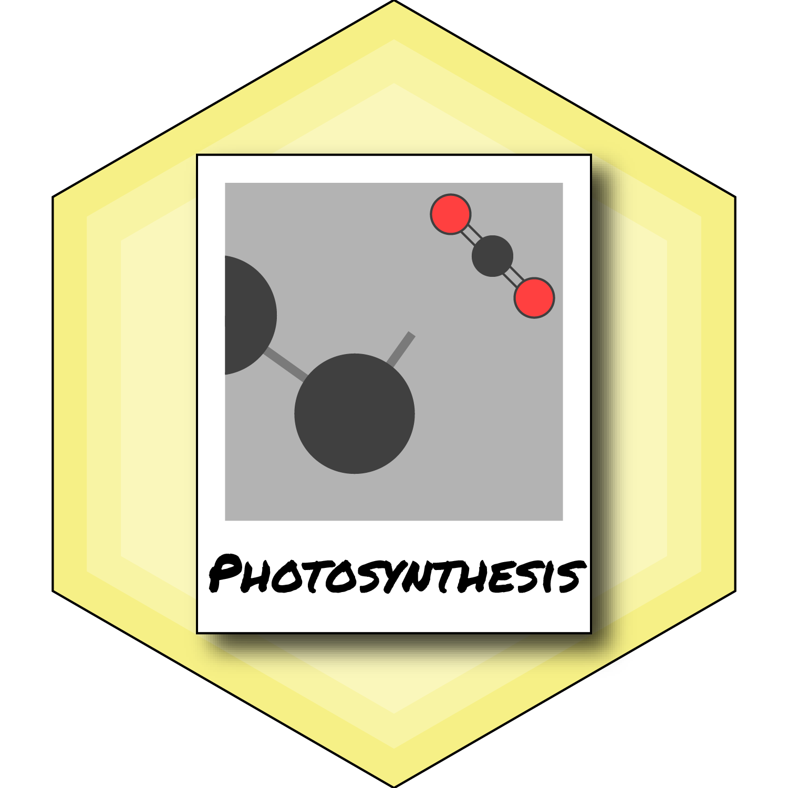

<!-- README.md is generated from README.Rmd. Please edit that file -->

# photosynthesis 

<!-- badges: start -->

[](https://cran.r-project.org/package=photosynthesis)
[](https://cran.r-project.org/package=photosynthesis)
[](https://github.com/cdmuir/photosynthesis/actions/workflows/R-CMD-check.yaml)
<!-- badges: end -->

## Model C3 Photosynthesis

## Description

**photosynthesis** is an R package with modeling tools for C3
photosynthesis, as well as analytical tools for curve-fitting plant
ecophysiology responses. It uses the R package
[**units**](https://CRAN.R-project.org/package=units) to ensure that
parameters are properly specified and transformed before calculations.

## Get **photosynthesis**

From CRAN

``` r
install.packages("photosynthesis")
```

or from GitHub

``` r
install.packages("remotes")
remotes::install_github("cdmuir/photosynthesis")
```

And load `photosynthesis`

``` r
library("photosynthesis")
```

## Vignettes

See the following vignettes for examples of what **photosynthesis** can
do:

- [Introduction to the photosynthesis
  package](https://cdmuir.github.io/photosynthesis/articles/photosynthesis-introduction.html)
- [Modeling C3 Photosynthesis: recommendations for common
  scenarios](https://cdmuir.github.io/photosynthesis/articles/modeling-recommendations.html)
- [Fitting light response
  curves](https://cdmuir.github.io/photosynthesis/articles/light-response.html)
- [Fitting CO2 response
  curves](https://cdmuir.github.io/photosynthesis/articles/co2-response.html)
- [Fitting temperature response
  curves](https://cdmuir.github.io/photosynthesis/articles/temperature-response.html)
- [Fitting stomatal conductance
  models](https://cdmuir.github.io/photosynthesis/articles/stomatal-conductance.html)
- [Fitting light
  respiration](https://cdmuir.github.io/photosynthesis/articles/light-respiration.html)
- [Fitting mesophyll
  conductance](https://cdmuir.github.io/photosynthesis/articles/mesophyll-conductance.html)
- [Fitting pressure-volume
  curves](https://cdmuir.github.io/photosynthesis/articles/pressure-volume.html)
- [Fitting hydraulic vulnerability
  curves](https://cdmuir.github.io/photosynthesis/articles/hydraulic-vulnerability.html)
- [Sensitivity
  Analysis](https://cdmuir.github.io/photosynthesis/articles/sensitivity-analysis.html)

## Contributors

- [Joseph Stinziano](https://github.com/jstinzi)
- [Chris Muir](https://github.com/cdmuir)
- Cassaundra Roback
- Demi Sargent
- Bridget Murphy
- Patrick Hudson

## Comments and contributions

We welcome comments, criticisms, and especially contributions! GitHub
issues are the preferred way to report bugs, ask questions, or request
new features. You can submit issues here:

<https://github.com/cdmuir/photosynthesis/issues>

## Meta

- Please [report any issues or
  bugs](https://github.com/cdmuir/photosynthesis/issues).
- License: MIT
- Get citation information for **photosynthesis** in R doing
  `citation(package = 'photosynthesis')`
- Please note that this project is released with a [Contributor Code of
  Conduct](https://github.com/cdmuir/photosynthesis/blob/master/CONDUCT.md).
  By participating in this project you agree to abide by its terms.
